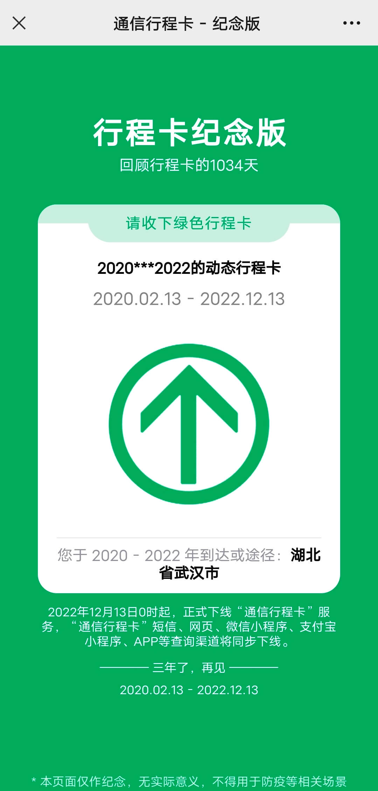
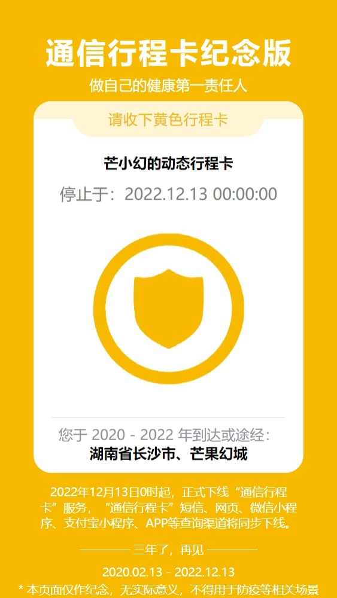
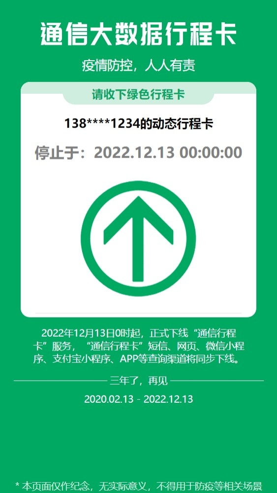

# 通信行程卡纪念版 H5

仓库地址：[GitHub](https://github.com/coder-xiaomo/travel-card) [Gitee](https://gitee.com/coder-xiaomo/travel-card)

演示地址：https://coder-xiaomo.gitee.io/travel-card/

## 更多版本

感谢大家提的Pr，由于功能差异无法合并到同一分支，所以合并到不同分支中了，大家可以前往以下分支查看：

### [feat-color](https://gitee.com/coder-xiaomo/travel-card/tree/feat-color/): 黄、红卡及彩蛋卡版

> [@小林囝](https://gitee.com/teochew)提交的[Pull Request](https://gitee.com/coder-xiaomo/travel-card/pulls/1)

**演示地址：https://coder-xiaomo.gitee.io/travel-card/feat-color**

### [feat-optimize](https://gitee.com/coder-xiaomo/travel-card/tree/feat-optimize/): 优化页面结构，更像原版，添加标题字体等

> [@呱行次比猫](https://space.bilibili.com/38238808)提交的[Pull Request](https://gitee.com/coder-xiaomo/travel-card/pulls/3)

**演示地址：https://coder-xiaomo.gitee.io/travel-card/feat-optimize**

## 一些说明

**注意：本项目仅作纪念，无实际意义，不得用于防疫等相关场景**

欢迎关注我的[B站](https://space.bilibili.com/457109942)和公众号（ID：程序员小墨）
